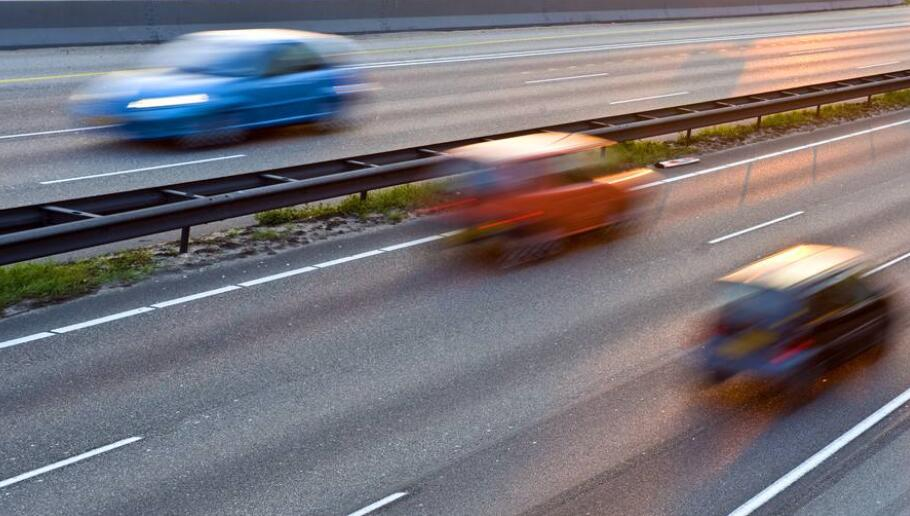
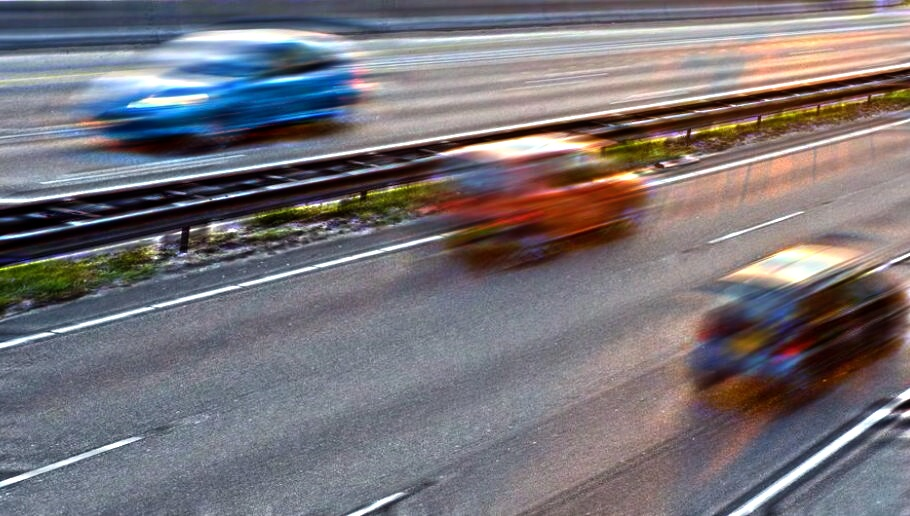

# Lucy-Richardson-Image-Deblur

This is a C++ implementation of Lucy Richardson Image Deblur approach that based on OpenCV.

The referenced paper can be found [here](Iterative Richardson-Lucy Based Improved Fast Image Deblurring and Denoising Approach.pdf).

# Setup

* Set up OpenCV  2.4.11

* RLMain.cpp

  1.Change the path of input image

  2.Setup PSF parameters

```

  CvMat* GetPSF(float angle, int length);	

```

  3.Setup Iteration numbers

```

  IplImage* RLdeconvolution(IplImage* imageFloat, CvMat* psf, int iterNum);

```

  4.Change the path of output image

# Result




